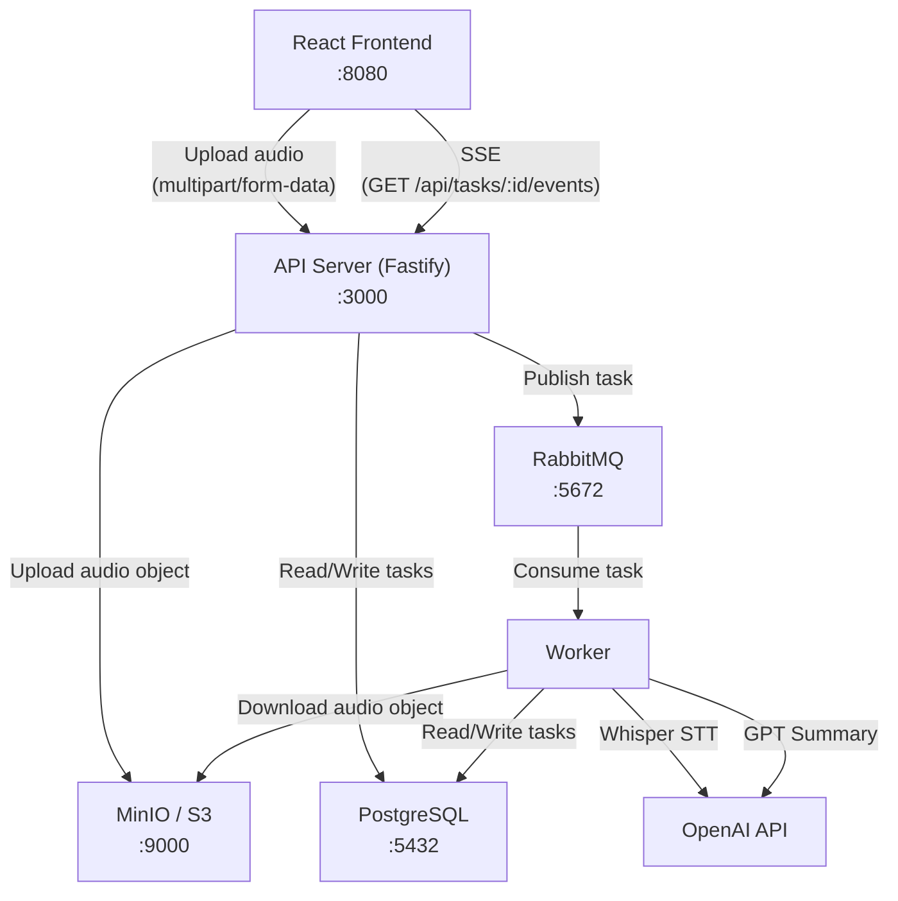
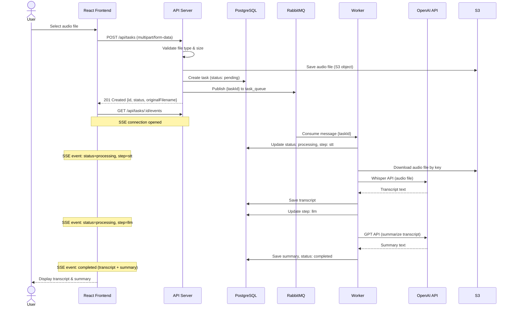
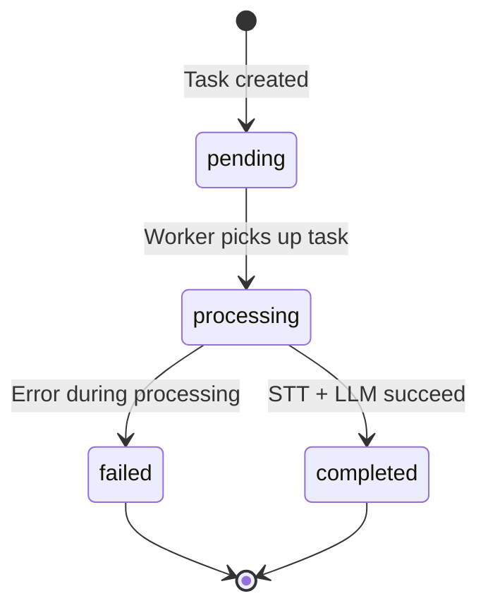

# Architecture

This document describes the architecture of the STT Summary Server, a speech-to-text summarization system built with a microservices-oriented approach using Fastify, RabbitMQ, PostgreSQL, MinIO (S3-compatible), and OpenAI APIs.

## System Architecture

The system consists of five main components that communicate through well-defined interfaces:

### Component Responsibilities

| Component | Role |
|-----------|------|
| **React Frontend** | Single-page application served on port 8080. Provides file upload UI, task list, and real-time progress tracking via SSE. |
| **API Server (Fastify)** | REST API on port 3000. Handles file uploads, task CRUD operations, SSE streaming, and publishes tasks to RabbitMQ. |
| **RabbitMQ** | Message broker on port 5672 (management UI on 15672). Decouples task creation from processing. Supports retries with dead-letter queue. |
| **Worker** | Background consumer that processes tasks from the queue. Calls OpenAI Whisper for transcription and GPT for summarization. |
| **PostgreSQL** | Primary data store on port 5432. Stores task metadata, transcripts, summaries, and status information via Prisma ORM. |
| **MinIO / S3** | Object storage for uploaded audio files. API writes objects and worker reads them using S3-compatible SDK calls. |
| **OpenAI API** | External service providing Whisper (speech-to-text) and GPT (text summarization) capabilities. |

## Sequence Diagram

The following diagram shows the complete flow from audio upload to summary delivery:

## Task Status Flow

Tasks follow a deterministic state machine with the following transitions:

### Status and Step Details

| Status | Step | Description |
|--------|------|-------------|
| `pending` | `null` | Task created and queued, awaiting worker pickup |
| `processing` | `stt` | Worker is transcribing audio via OpenAI Whisper |
| `processing` | `llm` | Worker is generating summary via GPT |
| `completed` | `null` | Both transcription and summarization finished successfully |
| `failed` | `null` | An error occurred during processing (after up to 3 retries) |

## Data Model

The system uses a single `tasks` table managed by Prisma ORM:

| Column | Type | Description |
|--------|------|-------------|
| `id` | UUID | Primary key, auto-generated |
| `status` | VARCHAR(20) | Current task status (`pending`, `processing`, `completed`, `failed`) |
| `step` | VARCHAR(20) | Current processing step (`stt`, `llm`, or null) |
| `original_filename` | VARCHAR(255) | Original uploaded file name |
| `file_path` | VARCHAR(500) | S3 object key for the uploaded audio file |
| `transcript` | TEXT | Whisper transcription output |
| `summary` | TEXT | GPT summary output |
| `error` | TEXT | Error message if task failed |
| `created_at` | TIMESTAMPTZ | Task creation timestamp |
| `updated_at` | TIMESTAMPTZ | Last update timestamp |
| `completed_at` | TIMESTAMPTZ | Completion timestamp (null until completed) |

## Message Queue Design

- **Queue**: `task_queue` (durable) -- main processing queue
- **Dead Letter Queue**: `task_queue_dlq` (durable) -- receives messages that have exhausted retries
- **Retry Strategy**: Up to 3 attempts per task. Failed messages are re-queued with an incremented `x-retry-count` header. After max retries, the message is routed to the DLQ and the task is marked as `failed`.
- **Prefetch**: Set to 1 to ensure workers process one task at a time.
