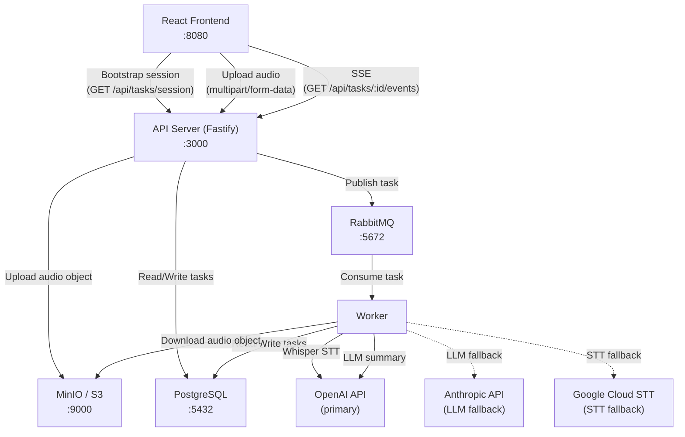
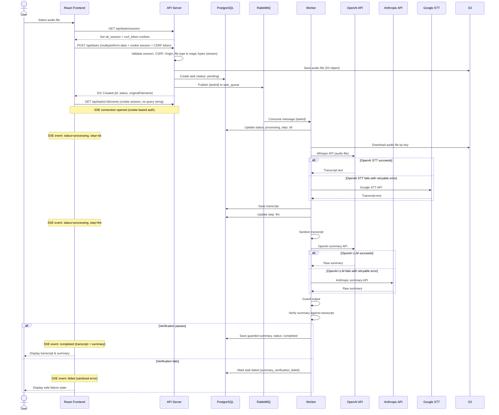
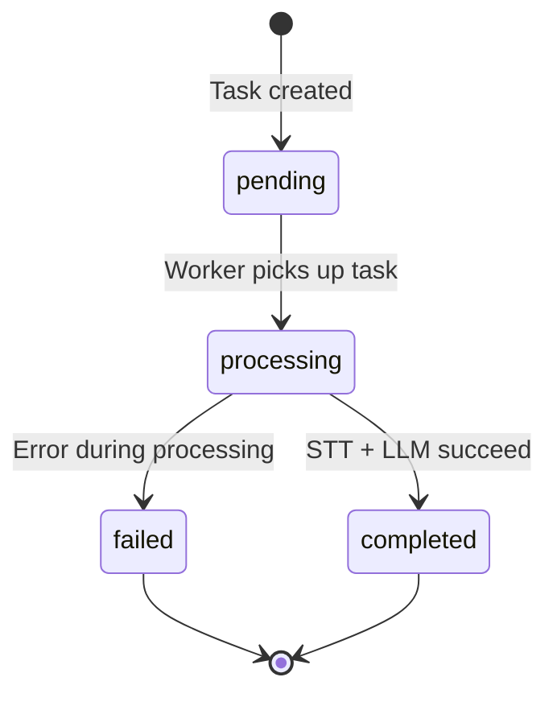

# Architecture

This document describes the architecture of the STT Summary Server, a speech-to-text summarization system built with a microservices-oriented approach using Fastify, RabbitMQ, PostgreSQL, MinIO (S3-compatible), and multiple AI providers behind fallback wrappers.

## System Architecture

The system consists of five main components that communicate through well-defined interfaces:

```mermaid
graph TB
    Client["React Frontend<br/>:8080"]
    API["API Server (Fastify)<br/>:3000"]
    MQ["RabbitMQ<br/>:5672"]
    Worker["Worker"]
    DB["PostgreSQL<br/>:5432"]
    S3["MinIO / S3<br/>:9000"]
    OpenAI["OpenAI API<br/>(primary)"]
    Anthropic["Anthropic API<br/>(LLM fallback)"]
    Google["Google Cloud STT<br/>(STT fallback)"]

    Client -- "Bootstrap session<br/>(GET /api/tasks/session)" --> API
    Client -- "Upload audio<br/>(multipart/form-data)" --> API
    Client -- "SSE<br/>(GET /api/tasks/:id/events)" --> API
    API -- "Upload audio object" --> S3
    API -- "Publish task" --> MQ
    API -- "Read/Write tasks" --> DB
    MQ -- "Consume task" --> Worker
    Worker -- "Read/Write tasks" --> DB
    Worker -- "Download audio object" --> S3
    Worker -- "Whisper STT" --> OpenAI
    Worker -- "LLM summary" --> OpenAI
    Worker -. "LLM fallback" .-> Anthropic
    Worker -. "STT fallback" .-> Google
```

### Component Responsibilities

| Component | Role |
|-----------|------|
| **React Frontend** | Single-page application served on port 8080. Bootstraps the session, uploads files, lists tasks, and tracks real-time progress via SSE. |
| **API Server (Fastify)** | REST API on port 3000. Handles session bootstrap, file uploads, task CRUD operations, SSE streaming, and publishes tasks to RabbitMQ. |
| **RabbitMQ** | Message broker on port 5672 (management UI on 15672). Decouples task creation from processing. Supports retries with dead-letter queue. |
| **Worker** | Background consumer that processes tasks from the queue. Uses fallback providers for STT/LLM, then runs a secure summary pipeline before persistence. |
| **PostgreSQL** | Primary data store on port 5432. Stores task metadata, transcripts, summaries, and status information via Prisma ORM. |
| **MinIO / S3** | Object storage for uploaded audio files. API writes objects and worker reads them using S3-compatible SDK calls. |
| **OpenAI API** | Primary provider for Whisper (speech-to-text) and chat completion summarization. |
| **Anthropic API** | Fallback LLM provider (Claude Sonnet 4.6) when OpenAI fails (timeout/5xx/429). |
| **Google Cloud STT** | Fallback STT provider when OpenAI Whisper fails (timeout/5xx/429). |

## Sequence Diagram

The following diagram shows the complete flow from audio upload to summary delivery:

```mermaid
sequenceDiagram
    actor User
    participant FE as React Frontend
    participant API as API Server
    participant DB as PostgreSQL
    participant MQ as RabbitMQ
    participant W as Worker
    participant OAI as OpenAI API
    participant ANT as Anthropic API
    participant GCP as Google STT

    User->>FE: Select audio file
    FE->>API: GET /api/tasks/session
    API-->>FE: Set stt_session + csrf_token cookies
    FE->>API: POST /api/tasks (multipart/form-data + cookie session + CSRF token)
    API->>API: Validate session, CSRF, Origin, file type & magic bytes (stream)
    API->>S3: Save audio file (S3 object)
    API->>DB: Create task (status: pending)
    API->>MQ: Publish {taskId} to task_queue
    API-->>FE: 201 Created {id, status, originalFilename}

    FE->>API: GET /api/tasks/:id/events (cookie session, no query string)
    Note over FE,API: SSE connection opened (cookie-based auth)

    MQ->>W: Consume message {taskId}
    W->>DB: Update status: processing, step: stt
    Note over FE: SSE event: status=processing, step=stt
    W->>S3: Download audio file by key
    W->>OAI: Whisper API (audio file)
    alt OpenAI STT succeeds
        OAI-->>W: Transcript text
    else OpenAI STT fails with retryable error
        W->>GCP: Google STT API
        GCP-->>W: Transcript text
    end
    W->>DB: Save transcript

    W->>DB: Update step: llm
    Note over FE: SSE event: status=processing, step=llm
    W->>W: Sanitize transcript
    W->>OAI: OpenAI summary API
    alt OpenAI LLM succeeds
        OAI-->>W: Raw summary
    else OpenAI LLM fails with retryable error
        W->>ANT: Anthropic summary API
        ANT-->>W: Raw summary
    end
    W->>W: Guard output
    W->>W: Verify summary against transcript
    alt Verification passes
        W->>DB: Save guarded summary, status: completed
        Note over FE: SSE event: completed (transcript + summary)
        FE-->>User: Display transcript & summary
    else Verification fails
        W->>DB: Mark task failed (summary_verification_failed)
        Note over FE: SSE event: failed (sanitized error)
        FE-->>User: Display safe failure state
    end
```

## Task Status Flow

Tasks follow a deterministic state machine with the following transitions:

```mermaid
stateDiagram-v2
    [*] --> pending: Task created
    pending --> processing: Worker picks up task
    processing --> completed: STT + LLM succeed
    processing --> failed: Error during processing
    failed --> [*]
    completed --> [*]
```

### Status and Step Details

| Status | Step | Description |
|--------|------|-------------|
| `pending` | `null` | Task created and queued, awaiting worker pickup |
| `processing` | `stt` | Worker is transcribing audio via OpenAI Whisper with Google STT fallback |
| `processing` | `llm` | Worker is sanitizing transcript, generating summary, and verifying output |
| `completed` | `null` | Transcript is stored and summary passed guard + deterministic verification |
| `failed` | `null` | STT, LLM, timeout, or summary verification failed (after retry policy where applicable) |

## Data Model

The system uses Prisma ORM with the following tables:

### `tasks` table

| Column | Type | Description |
|--------|------|-------------|
| `id` | UUID | Primary key, auto-generated |
| `status` | VARCHAR(20) | Current task status (`pending`, `processing`, `completed`, `failed`) |
| `step` | VARCHAR(20) | Current processing step (`stt`, `llm`, or null) |
| `session_id` | VARCHAR(36) | Server-managed session ID (references `sessions.id`) |
| `original_filename` | VARCHAR(255) | Original uploaded file name |
| `file_path` | VARCHAR(500) | S3 object key for the uploaded audio file |
| `transcript` | TEXT | Stored transcription output from primary or fallback STT provider |
| `summary` | TEXT | Guarded and verified summary output only |
| `error` | TEXT | Error message if task failed |
| `created_at` | TIMESTAMPTZ | Task creation timestamp |
| `updated_at` | TIMESTAMPTZ | Last update timestamp |
| `completed_at` | TIMESTAMPTZ | Completion timestamp (null until completed) |

**Indexes:** `idx_tasks_session_id` (session_id), `idx_tasks_status` (status)

### `sessions` table

| Column | Type | Description |
|--------|------|-------------|
| `id` | UUID | Primary key, auto-generated |
| `ua_hash` | VARCHAR(64) | SHA-256 hash of User-Agent |
| `ip_prefix` | VARCHAR(48) | First 3 octets of client IP |
| `csrf_token` | VARCHAR(64) | CSRF double-submit token |
| `expires_at` | TIMESTAMPTZ | Session expiration time |
| `rotated_to` | UUID | ID of replacement session (nullable) |
| `revoked` | BOOLEAN | Whether session has been revoked |
| `created_at` | TIMESTAMPTZ | Session creation timestamp |
| `last_seen_at` | TIMESTAMPTZ | Last activity timestamp |

## Security

See [docs/security.md](security.md) for the full security architecture. Key highlights:

- **Two auth models**: Cookie session (task routes) and API key (other routes), enforced via strict regex route matching
- **Server-managed sessions**: HttpOnly `stt_session` cookie, bound to User-Agent hash + IP prefix, stored in PostgreSQL
- **Session bootstrap endpoint**: `GET /api/tasks/session` initializes session state and CSRF token for browser clients
- **Bootstrap-only rotated-session recovery**: stale rotated cookies can be repaired only through `GET /api/tasks/session`; other routes still reject revoked sessions
- **CSRF double-submit**: `csrf_token` JS-readable cookie + `X-CSRF-Token` header with constant-time comparison
- **Streaming uploads**: 16-byte head read for magic byte validation, stream piped to S3 (no `toBuffer()`)
- **Secure summary pipeline**: sanitize transcript, generate summary, guard output, verify deterministically, then persist
- **Deep log redaction**: Recursive redaction of secrets in all log output (API keys, bearer tokens, session tokens, sensitive query params)
- **Security headers**: CSP, X-Content-Type-Options, Referrer-Policy via Helmet
- **Per-endpoint rate limiting**: Different limits per route, health check exempt

## Message Queue Design

- **Queue**: `task_queue` (durable) -- main processing queue
- **Dead Letter Queue**: `task_queue_dlq` (durable) -- receives messages that have exhausted retries
- **Retry Strategy**: Up to 3 attempts per task. Failed messages are re-queued with an incremented `x-retry-count` header. After max retries, the message is routed to the DLQ and the task is marked as `failed`.
- **Prefetch**: Set to 1 to ensure workers process one task at a time.
